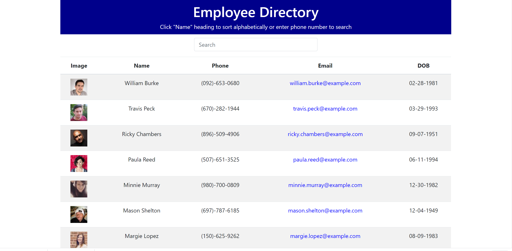
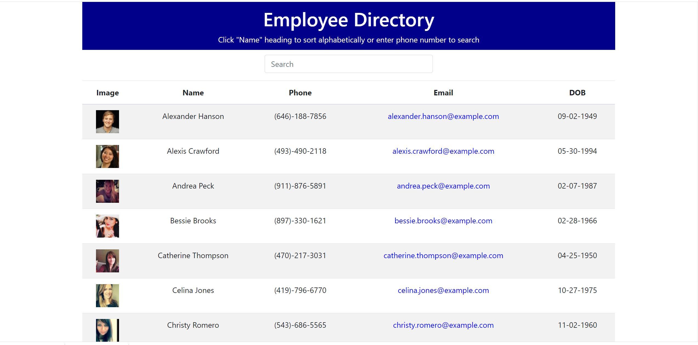
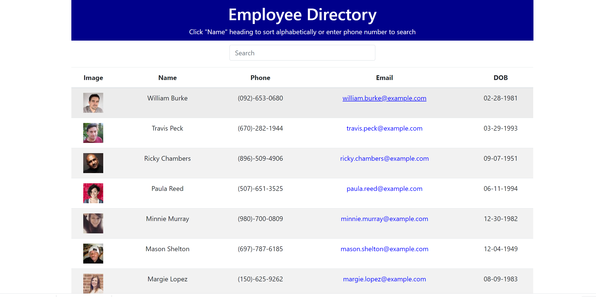
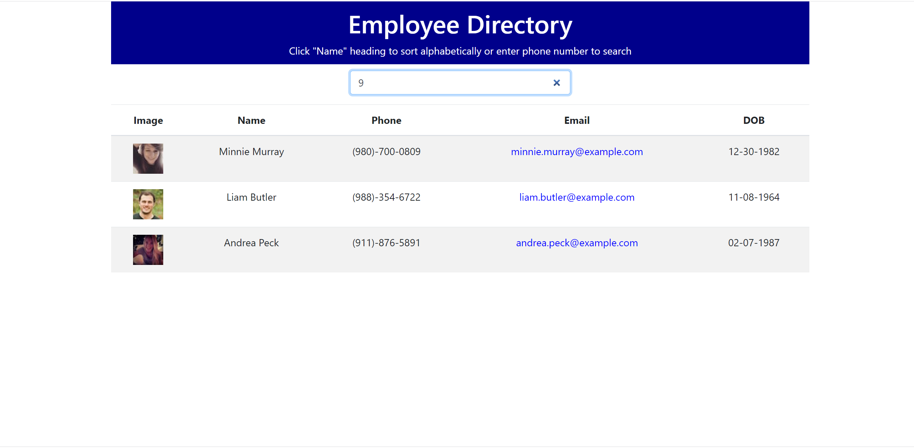

# Employee Directory

## The Repository

The link to the website repository: [Website Repo link](https://github.com/NavdeepDP/employee-directory-app)

The link to deployed website [Website Link](https://navdeepdp.github.io/employee-directory-app/)

## Development Environment
- Code is developed in VS code Studio using React.

## Website Functionality
An employee or manager would benefit greatly from being able to view non-sensitive data about other employees. 
It would be particularly helpful to be able to filter employees by name.

The user should be able to:

  * Sort the table by at "Name"

  * Filter the users by  Phone number. (Enter phone number in search box)

### On Page load 

### Sorted 

### Search with phone number

## Available Scripts
In the project directory, you can run:
### `npm start`
Runs the app in the development mode.\
Open [http://localhost:3000](http://localhost:3000) to view it in the browser.
he page will reload if you make edits.\
You will also see any errors in the console.
### `npm run deploy`

## References

### Documentation
[Create React App documentation](https://facebook.github.io/create-react-app/docs/getting-started).
[React documentation](https://reactjs.org/).

### Advanced Configuration
[https://facebook.github.io/create-react-app/docs/advanced-configuration](https://facebook.github.io/create-react-app/docs/advanced-configuration)

### Deployment
[https://facebook.github.io/create-react-app/docs/deployment](https://facebook.github.io/create-react-app/docs/deployment)
